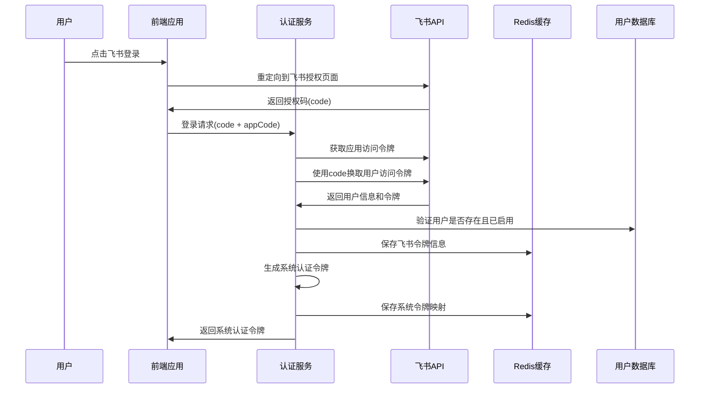
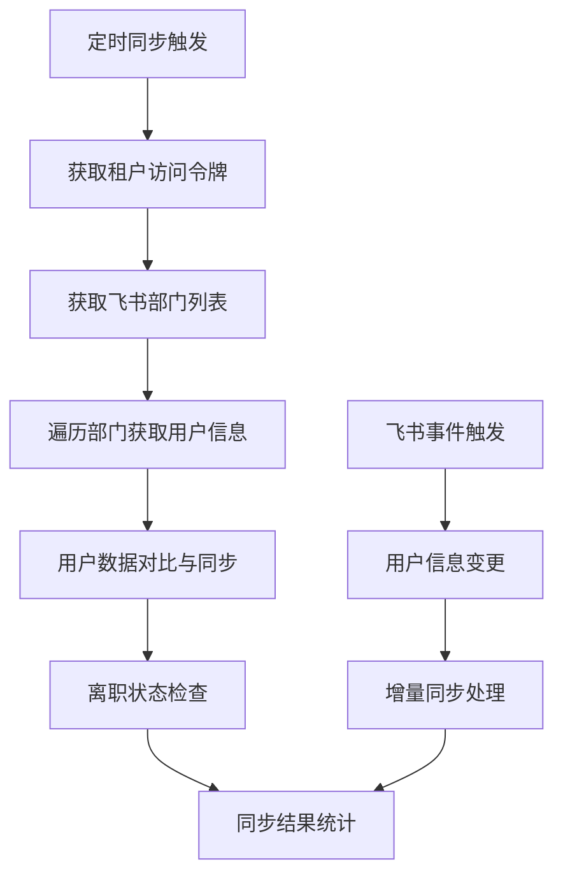
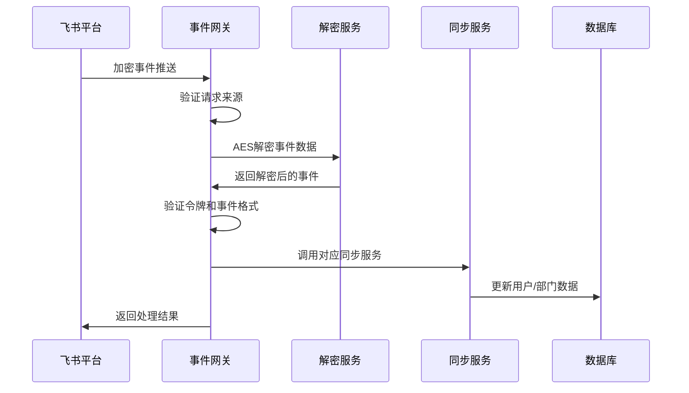
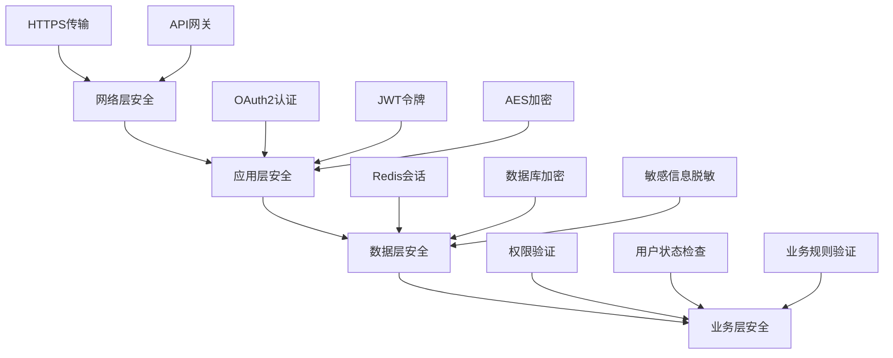

# 飞书认证登录安全机制详细文档

## 概述

本文档详细分析了公司网站集成飞书认证登录的完整安全机制，包括用户认证、用户同步和事件回调处理三个核心组件的工作原理和安全保障措施。

## 系统架构

### 三个核心项目

1. **yuexin-user-auth** - 飞书登录认证服务
2. **yuexin-user-sync** - 飞书用户同步服务
3. **yuexin-user-sync-gateway** - 飞书事件回调网关

### 技术栈
- **框架**: Spring Boot + Dubbo
- **缓存**: Redis
- **通信**: OpenFeign (HTTP客户端)
- **加密**: AES-256 CBC模式
- **令牌管理**: MD5散列 + UUID
- **数据格式**: JSON

## 1. 飞书登录认证流程 (yuexin-user-auth)

### 1.1 认证流程概述



### 1.2 核心组件详解

#### 1.2.1 FeiShuClient - 飞书API客户端

**位置**: `yuexin-user-auth/src/main/java/com/yuexin/user/auth/client/FeiShuClient.java`

**功能**:
- 通过OpenFeign与飞书开放平台API通信
- 获取应用访问令牌(`app_access_token`)
- 获取用户访问令牌(`user_access_token`)
- 刷新用户访问令牌

**安全措施**:
- 使用HTTPS通信（`https://open.feishu.cn`）
- 应用密钥(`app_secret`)通过配置文件管理
- 令牌有效期自动管理和刷新

**关键API**:
```java
// 获取应用访问令牌
@PostMapping("/auth/v3/app_access_token/internal")
AppAccessTokenResponse getAppAccessToken(@RequestBody AppAuthParams params);

// 获取用户访问令牌
@PostMapping("/authen/v1/access_token")
FeiShuResponse<UserAccessToken> getUserAccessToken(@RequestBody UserAuthParams params, @RequestHeader("Authorization") String appToken);

// 刷新用户访问令牌
@PostMapping("/v1/refresh_access_token")
FeiShuResponse<UserAccessToken> refreshAccessToken(@RequestBody RefreshTokenParams params, @RequestHeader("Authorization") String appToken);
```

#### 1.2.2 FeiShuUserService - 飞书用户服务

**位置**: `yuexin-user-auth/src/main/java/com/yuexin/user/auth/service/impl/FeiShuUserService.java`

**核心功能**:

1. **用户认证** (`getUserVise`方法):
   - 使用OAuth2授权码模式获取用户信息
   - 验证授权码有效性
   - 返回用户基本信息和访问令牌

2. **令牌管理** (`getToken`和`saveToken`方法):
   - Redis中存储用户会话信息
   - 自动令牌刷新机制
   - 令牌过期检查和处理

3. **会话管理**:
   - Redis key格式: `FEI_SHU_SESSION_PREFIX + appCode + "_" + userId`
   - 存储内容: 飞书ID、访问令牌、刷新令牌、过期时间
   - 自动过期时间管理

**安全特性**:
```java
// 令牌存储结构
Map<String, String> sessionData = {
    "feiShuId": "用户飞书ID",
    "accessToken": "访问令牌",
    "refreshToken": "刷新令牌",
    "expiresTime": "过期时间(提前60秒)",
    "refreshExpiresTime": "刷新令牌过期时间(提前60秒)"
};

// 过期时间安全冗余
.plusSeconds(params.getExpiresIn() - 60)  // 提前60秒过期
```

#### 1.2.3 AuthService - 认证服务

**位置**: `yuexin-user-auth/src/main/java/com/yuexin/user/auth/service/impl/AuthServiceImpl.java`

**登录流程** (`login`方法):

1. **获取飞书用户信息**:
   ```java
   SSOUserService.UserVise userVise = ssoUserService.getUserVise(
       new SSOUserService.GetParams().setCode(params.getCode()).setAppCode(params.getAppCode())
   );
   ```

2. **用户验证**:
   ```java
   User user = userService.get(new UserService.GetParams().setFeishuId(userVise.getUserId()));
   if (user == null) {
       throw new BusinessException("用户不存在, 请联系管理员", ErrorCode.GB0090);
   }
   if (user.getDisabled() == null || user.getDisabled()) {
       throw new BusinessException("用户未启用, 请联系管理员", ErrorCode.GB0090);
   }
   ```

3. **保存飞书令牌**:
   ```java
   SSOUserService.SaveTokenParams saveTokenParams = new SSOUserService.SaveTokenParams()
       .setAccessToken(userVise.getUserAccessToken())
       .setRefreshToken(userVise.getRefreshToken())
       .setExpiresIn(userVise.getExpiresIn())
       .setUserId(user.getId())
       .setSsoUserId(userVise.getUserId())
       .setAppCode(params.getAppCode())
       .setRefreshExpiresIn(userVise.getRefreshExpiresIn());
   ssoUserService.saveToken(saveTokenParams);
   ```

4. **生成系统令牌**:
   ```java
   return authTokenService.generate(user.getId());
   ```

#### 1.2.4 AuthTokenService - 系统令牌服务

**位置**: `yuexin-user-auth/src/main/java/com/yuexin/user/auth/service/impl/AuthTokenServiceImpl.java`

**令牌生成机制**:
```java
public String generate(Long userId) {
    // 使用UUID + MD5生成唯一令牌
    String token = new MD5Utils().getMd5(UUID.randomUUID().toString());

    // 双向映射存储: 令牌->用户ID, 用户ID->令牌
    stringRedisTemplate.opsForValue().set(USER_ID_PREFIX + token, userId.toString(), expireHours, TimeUnit.HOURS);
    stringRedisTemplate.opsForValue().set(USER_TOKEN_PREFIX + userId, token, expireHours, TimeUnit.HOURS);

    return token;
}
```

**安全特性**:
- **双向映射**: 支持通过令牌查用户ID，也支持通过用户ID查令牌
- **自动过期**: 默认24小时过期(可配置)
- **会话延续**: `continueLogin`方法自动延长令牌有效期
- **安全清理**: `delete`方法同时删除双向映射

### 1.3 安全保障措施

1. **多层验证**:
   - 飞书授权码验证
   - 用户存在性验证
   - 用户启用状态验证

2. **令牌管理**:
   - 飞书令牌和系统令牌分离
   - 自动刷新机制
   - 过期时间冗余(提前60秒)

3. **会话安全**:
   - Redis集中式会话管理
   - 双向令牌映射
   - 自动过期清理

## 2. 飞书用户同步机制 (yuexin-user-sync)

### 2.1 同步架构概述



### 2.2 核心组件详解

#### 2.2.1 FeishuTokenService - 飞书令牌服务

**位置**: `yuexin-user-sync/src/main/java/com/yuexin/user/sync/service/impl/FeishuTokenServiceImpl.java`

**功能**:
- 获取企业访问令牌(`tenant_access_token`)
- 令牌刷新和缓存管理

**安全实现**:
```java
public String getTenantAccessToken() {
    // 构建请求参数
    Map<String, String> httpBody = new HashMap<String, String>() {{
        put("app_id", feishuProperty.getAppId());
        put("app_secret", feishuProperty.getAppSecret());
    }};

    // HTTPS请求飞书API
    ResponseEntity<TokenResult> rawResult = this.restTemplate.postForEntity(
        this.feishuProperty.getTenantAccessTokenUri(),
        httpEntity,
        TokenResult.class
    );

    // 验证响应结果
    if (rawResult.getBody().getCode() != FeishuConstants.REQUEST_SUCCESS_CODE) {
        return null;
    }

    return rawResult.getBody().getTenant_access_token();
}
```

#### 2.2.2 UserSyncService - 用户同步服务

**位置**: `yuexin-user-sync/src/main/java/com/yuexin/user/sync/service/impl/UserSyncServiceImpl.java`

**全量同步流程** (`syncFully`方法):

1. **获取企业令牌**:
   ```java
   String tenantAccessToken = this.feishuTokenService.getTenantAccessToken();
   if (StringUtils.isEmpty(tenantAccessToken)) {
       throw new BusinessException("获取租户token失败", ErrorCode.GB0099);
   }
   ```

2. **获取部门结构**:
   ```java
   List<FeishuDepartment> departmentItems = this.feishuDepartmentService.getDepartmentList(
       new FeishuDepartmentService.DepartmentListParam()
           .setDepartmentId(FeishuConstants.ROOT_DEPARTMENT_ID)
           .setDepartmentIdType("department_id")
           .setUserIdType("user_id")
           .setFetchChild(true),
       tenantAccessToken
   );
   ```

3. **同步用户数据**:
   ```java
   // 同步根部门用户
   List<FeishuUser> feishuUsers = new ArrayList<>(
       this.syncUserForSingleDepartment(result, tenantAccessToken, FeishuConstants.ROOT_DEPARTMENT_ID)
   );

   // 遍历各部门同步用户
   for (FeishuDepartment departmentItem : departmentItems) {
       feishuUsers.addAll(
           this.syncUserForSingleDepartment(result, tenantAccessToken, departmentItem.getDepartment_id())
       );
   }
   ```

4. **离职状态检查**:
   ```java
   private void checkResigned(@NotEmpty List<FeishuUser> feishuUsers) throws BusinessException {
       // 构建飞书用户映射
       Map<String, FeishuUser> feishuUserMap = feishuUsers.stream()
           .collect(Collectors.toMap(FeishuUser::getUser_id, v -> v, (v1, v2) -> v1));

       // 查询系统中所有用户
       List<User> users = this.userService.query(
           new UserService.QueryParams().setPage(new PageParams().setPageNumber(1).setPageSize(10000))
       ).getRecords();

       // 检查离职和误操作
       for (User user : users) {
           if (feishuUserMap.get(user.getFeishuId()) == null) {
               // 飞书中不存在，标记为离职
               if (this.nonNull(user.getStatus()) != 0) {
                   usersToResign.add(user);
               }
           } else {
               // 飞书中存在，但系统中标记为离职，恢复状态
               if (this.nonNull(user.getStatus()) == 0) {
                   usersNotRegigned.add(user);
               }
           }
       }
   }
   ```

**增量同步处理**:

1. **用户创建事件**:
   ```java
   public void create(FeishuUser feishuUser) throws BusinessException {
       log.info("收到飞书事件：员工入职" + JSON.toJSONString(feishuUser));
       this.executeAdd(new SyncResult(), feishuUser);
       this.departmentSyncService.updateUsers(feishuUser.getDepartment_ids(), true);
   }
   ```

2. **用户更新事件**:
   ```java
   public void update(FeishuUser feishuUser, FeishuUser oldFeishuUser) throws BusinessException {
       User originalUser = this.userService.get(
           new UserService.GetParams().setFeishuId(feishuUser.getUser_id())
       );
       this.executeModify(new SyncResult(), feishuUser, originalUser);

       // 部门变更处理
       if (oldFeishuUser.getDepartment_ids() != null) {
           String[] relatedDepartmentIds = AggUtils.bind(
               oldFeishuUser.getDepartment_ids(),
               feishuUser.getDepartment_ids(),
               String.class
           );
           this.departmentSyncService.updateUsers(relatedDepartmentIds, true);
       }
   }
   ```

3. **用户删除事件**:
   ```java
   public void delete(String userId) throws BusinessException {
       User originalUser = this.userService.get(
           new UserService.GetParams().setFeishuId(userId)
       );

       // 标记用户为离职状态
       this.executeModify(new SyncResult(),
           new FeishuUser()
               .setUser_id(userId)
               .setStatus(new FeishuUser.UserStatus().set_resigned(true))
               .setAvatar(new FeishuUser.AvatarInfo().setAvatar_origin(originalUser.getAvatar())),
           originalUser
       );
   }
   ```

### 2.3 数据同步安全措施

1. **数据一致性**:
   - 事务性操作保证数据完整性
   - 失败重试机制
   - 详细的操作日志记录

2. **权限验证**:
   - 企业访问令牌验证
   - API调用频率限制
   - 数据范围限制

3. **数据保护**:
   - 敏感信息脱敏处理
   - 数据变更审计日志
   - 异常情况报警机制

## 3. 飞书事件回调网关 (yuexin-user-sync-gateway)

### 3.1 事件处理架构



### 3.2 核心组件详解

#### 3.2.1 FeishuEventController - 事件控制器

**位置**: `yuexin-user-sync-gateway/src/main/java/com/yuexin/user/sync/gateway/controller/FeishuEventController.java`

**事件接收处理** (`receive`方法):

1. **请求接收与解密**:
   ```java
   @PostMapping("/receive")
   public FeishuEventVO receive(@RequestBody FeishuEventOriginalParams req) throws BusinessException {
       log.info("接收到飞书的事件：" + JSON.toJSONString(req));

       // 解析并解密入参
       FeishuEventDecodedParam param = this.parseParam(req);

       if (param == null) {
           log.error("飞书事件解析结果为空，原请求参数为：" + JSON.toJSONString(req));
           return null;
       }
   }
   ```

2. **URL验证处理**:
   ```java
   // 飞书要求的URL验证机制
   if (FeishuEventType.URL_VERTIFICATION.getCode().equals(param.getType())) {
       if (!this.verificationToken.equals(param.getToken())) {
           return new FeishuEventVO().setChallenge(StringUtils.EMPTY);
       }
       return new FeishuEventVO().setChallenge(param.getChallenge());
   }
   ```

3. **事件分发处理**:
   ```java
   private boolean eventHandler(@NotNull FeishuEventController.FeishuEventDecodedParam param) {
       String eventType = param.getHeader().getEvent_type();
       JSONObject object = param.getEvent().getObject();

       // 根据事件类型分发处理
       if (FeishuEventType.USER_CREATED.getCode().equals(eventType)) {
           FeishuUser feishuUser = JSON.parseObject(JSON.toJSONString(object), FeishuUser.class);
           this.userSyncService.create(feishuUser);
       } else if (FeishuEventType.USER_DELETED.getCode().equals(eventType)) {
           FeishuUser feishuUser = JSON.parseObject(JSON.toJSONString(object), FeishuUser.class);
           this.userSyncService.delete(feishuUser.getUser_id());
       } else if (FeishuEventType.USER_UPDATED.getCode().equals(eventType)) {
           FeishuUser feishuUser = JSON.parseObject(JSON.toJSONString(object), FeishuUser.class);
           FeishuUser oldUser = JSON.parseObject(JSON.toJSONString(param.getEvent().getOld_object()), FeishuUser.class);
           this.userSyncService.update(feishuUser, oldUser);
       }
       // ... 部门事件处理类似
   }
   ```

#### 3.2.2 FeishuDecrypter - 事件解密服务

**位置**: `yuexin-user-sync-gateway/src/main/java/com/yuexin/user/sync/gateway/security/FeishuDecrypter.java`

**加密解密机制**:
```java
public class FeishuDecrypter {
    private byte[] keyBs;

    public FeishuDecrypter(String key) {
        MessageDigest digest = MessageDigest.getInstance("SHA-256");
        // 使用SHA-256对密钥进行散列
        keyBs = digest.digest(key.getBytes(StandardCharsets.UTF_8));
    }

    public String decrypt(String base64) throws Exception {
        byte[] decode = Base64.getDecoder().decode(base64);

        // AES/CBC/NOPADDING解密
        Cipher cipher = Cipher.getInstance("AES/CBC/NOPADDING");

        // 提取IV(前16字节)
        byte[] iv = new byte[16];
        System.arraycopy(decode, 0, iv, 0, 16);

        // 提取加密数据(除前16字节外的所有数据)
        byte[] data = new byte[decode.length - 16];
        System.arraycopy(decode, 16, data, 0, data.length);

        // 初始化解密器
        cipher.init(Cipher.DECRYPT_MODE,
                   new SecretKeySpec(keyBs, "AES"),
                   new IvParameterSpec(iv));

        // 解密并去除填充
        byte[] r = cipher.doFinal(data);

        // 去除PKCS7填充
        if (r.length > 0) {
            int p = r.length - 1;
            for (; p >= 0 && r[p] <= 16; p--) {}
            if (p != r.length - 1) {
                byte[] rr = new byte[p + 1];
                System.arraycopy(r, 0, rr, 0, p + 1);
                r = rr;
            }
        }

        return new String(r, StandardCharsets.UTF_8);
    }
}
```

### 3.3 事件安全保障

1. **数据加密**:
   - AES-256 CBC模式加密
   - SHA-256密钥散列
   - Base64编码传输

2. **身份验证**:
   - 验证令牌(`verificationToken`)验证
   - 加密密钥(`encryptKey`)验证
   - 双重验证机制

3. **事件完整性**:
   - 事件格式验证
   - 事件类型验证
   - 异常处理和重试机制

## 4. 整体安全架构分析

### 4.1 安全层次结构



### 4.2 安全特性总结

#### 4.2.1 认证安全
- **多因子认证**: OAuth2 + 飞书企业认证
- **令牌分离**: 飞书令牌与系统令牌分离管理
- **自动刷新**: 令牌过期自动刷新机制
- **会话管理**: Redis集中式会话存储

#### 4.2.2 传输安全
- **HTTPS通信**: 所有API调用使用HTTPS
- **数据加密**: AES-256加密传输敏感数据
- **完整性校验**: 数字签名验证数据完整性

#### 4.2.3 存储安全
- **敏感数据加密**: 密钥和令牌加密存储
- **访问控制**: 基于角色的访问控制
- **数据脱敏**: 日志中敏感信息自动脱敏

#### 4.2.4 业务安全
- **用户状态验证**: 登录时检查用户启用状态
- **权限边界**: 严格的权限范围控制
- **异常处理**: 完善的异常处理和恢复机制

### 4.3 安全风险与防护

#### 4.3.1 已实现的安全防护

1. **防重放攻击**:
   - 令牌时效性控制
   - 事件ID唯一性验证

2. **防中间人攻击**:
   - HTTPS强制加密
   - 证书验证

3. **防数据泄露**:
   - 敏感数据加密存储
   - 访问日志审计

4. **防权限提升**:
   - 严格的用户状态检查
   - 角色权限验证

#### 4.3.2 潜在安全考虑

1. **令牌安全**:
   - 建议实现令牌黑名单机制
   - 考虑实现设备绑定

2. **监控告警**:
   - 异常登录行为监控
   - API调用频率监控

3. **数据备份**:
   - 定期数据备份
   - 灾难恢复预案

## 5. 配置安全要求

### 5.1 关键配置项

```yaml
# 飞书应用配置
feishu:
  app-id: ${FEISHU_APP_ID}           # 从环境变量获取
  app-secret: ${FEISHU_APP_SECRET}   # 从环境变量获取

# 事件回调配置
feishu-event-controller:
  encrypt-key: ${FEISHU_ENCRYPT_KEY}           # 加密密钥
  verification-token: ${FEISHU_VERIFICATION_TOKEN}  # 验证令牌

# 令牌服务配置
auth-token-service:
  expire-hours: 24    # 令牌过期时间

# Redis配置
spring:
  redis:
    host: ${REDIS_HOST}
    port: ${REDIS_PORT}
    password: ${REDIS_PASSWORD}
```

### 5.2 安全配置建议

1. **环境变量管理**:
   - 所有敏感配置使用环境变量
   - 生产环境配置加密存储

2. **网络安全**:
   - API网关访问控制
   - IP白名单限制

3. **监控日志**:
   - 详细的操作审计日志
   - 异常行为告警机制

## 6. 部署和运维安全

### 6.1 部署安全
- 容器化部署隔离
- 最小权限原则
- 定期安全更新

### 6.2 运维监控
- 实时性能监控
- 安全事件告警
- 定期安全评估

## 结论

该飞书认证登录安全机制通过三层架构设计，实现了从用户认证、数据同步到事件处理的完整安全保障。系统采用了多重安全措施，包括OAuth2认证、AES加密、令牌管理、会话控制等，能够有效保护用户数据和系统安全。

建议定期进行安全评估和漏洞扫描，持续优化安全策略，确保系统安全性与业务需求的平衡。